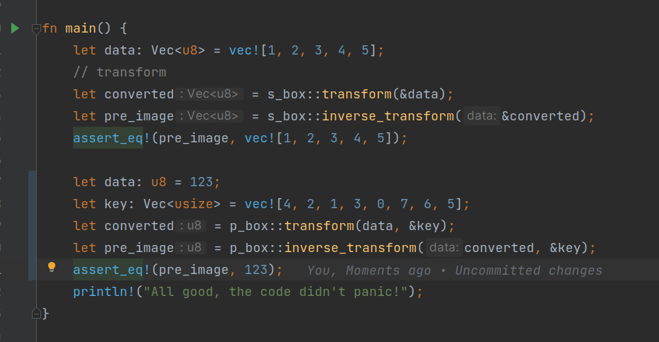
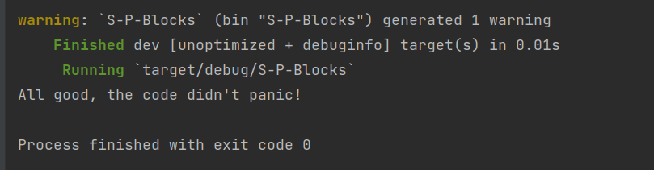

<body>
    <h1> S-Box and P-box, assignment 3</h1>
    <h2>
        Task:
    </h2>
    

        Реалізуйте свої власні функції для прямого і зворотного перетворення за алгоритмом S-блоку, а також за алгоритмом P-блоку. Мову програмування для реалізації оберіть на власний розсуд. Таблицю констант для реалізації S-блоку оберіть з рекомендованих, що доступні публічно або сгенеруйте самостійно. Формулу перестановки для реалізації P-блоку оберіть на власний розсуд.
        Для S-блоку алгоритмом зворотного перетворення може бути той самий алгоритм, але з застосуванням функції обчислення зворотної таблиці констант. Фактично така функція має приймати таблицю констант для прямого перетворення і повертати таблицю констано для зворотного перетворення.
        Важливо написати тести для власної реалізації алгоритмів S-блоку та P-блоку, з метою переконатися в правильності функціонування. Для певного набору даних, якщо виконати послідовно пряме та зворотне перетворення, то маємо отримати початковий набір даних.
    

    <h2>
        Launch Instructions
    </h2>
    

        To launch the program (same as tests), type <code> cargo run</code> in the terminal while being in the project directory.
    

    

        To launch the tests for the program, type <code> cargo test</code> in the terminal while being in the project directory.
    

    <h2>Example: </h2>
    

        Code example (should output that the code didn't panic, otherwise there would be a logical error in the code):
    

    
    

        Actual output:
    

    
</body>